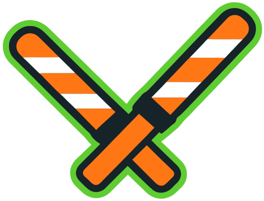

# Groundcrew and Clearance

  

## [groundcrew](./packages/groundcrew)

Groundcrew watches Linear projects and provisions coding-agent workspaces backed by git worktrees, with local Safehouse execution and remote runner support.

  

## [clearance](./packages/clearance)

A local HTTP/HTTPS forward proxy that gates network egress against a hostname allowlist for deny-by-default sandboxes, CI workers, and isolated agent runs.
